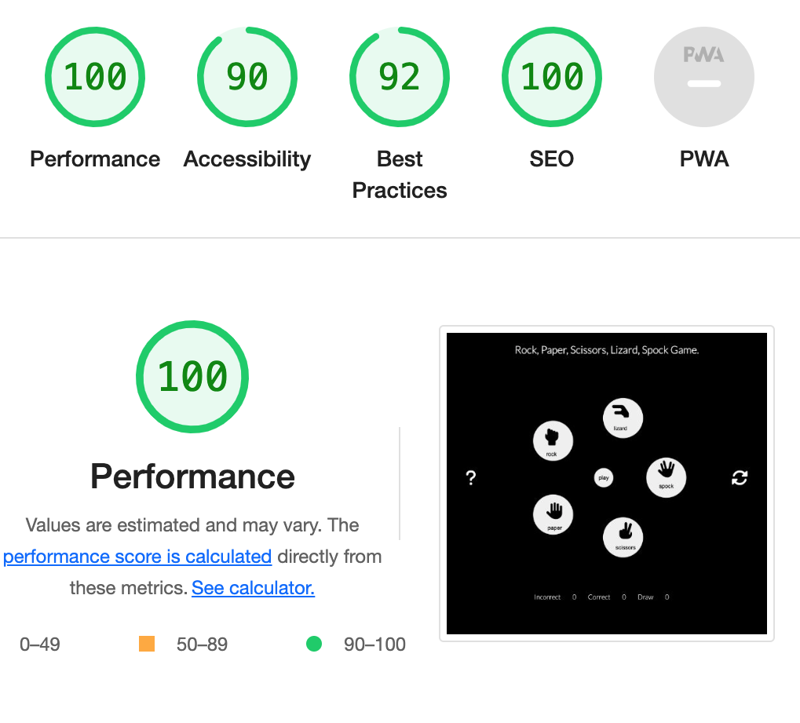

# **Rock, Paper, Scissors, Lizard, Spock Game**

#### Rock, Paper, Scissors, Lizard, Spock is web based game, originally invented by Sam Kass with Karen Bryla. It is based on the classic selection method game rock-paper-scissors, expanding two additional weapons lizard and Spock which is formed by the Star Trek Vulcan salute

#### **Rules:**

##### The rules of Rock, paper, scissors, lizard, Spock are

- Scissors cut paper
- Paper covers rock
- Rock crushes lizard
- Lizard poisons Spock
- Spock smashes scissors
- Scissors decapitate lizard
- Lizard eats paper
- Paper disproves Spock
- Spock vaporizes rock
- Rock breaks scissors

## **Features**

### **Existing Features**

#### Initial page

#### Heading

- The heading gives awarenes of the name of the game

#### Info button

- The button with the icon question mark, is a popup icon button, which onclicked opens the rules of the game

#### Game area

- Game area consists of six buttons, five larger ones in a circle and a smaller one in the middle. The large buttons contain an icon that represents a specific hand gesture, and a text with it/'s name underneath
  - rock - icon of a hand in a fist
  - paper - icon of a hand with outstreched fingers
  - scissors - icon of a hand with index and middle finger oustreched apart
  - lizard - icon of a hand with all fingers touching
  - spock - icon which formed by the Star Trek Vulcan salute, outreched fingers with index and middle together apart of ring and little finger
  - play - the smaller button with text play on it

#### Reset button

- Reset button has and icon of two arrows in a circle, when clicked it clears the score and sets it back to 0

#### Score area

- Score area has three elements - correct, incorrect and draw, from left to right, next to each one is the current score, which is set to 0 at the beginning of the game and updates, while playing

#### Result

- Underneath the heading, after the right combination of one large button clicked and button named play after, shows a paragraph with the user choice input, a random input shuffled by the computer, which is been comparated and returns is it is a draw win or loose and the specific combination of it

#### End

- The game is limited to five tries,the following click after automatically resets the result.

## **Testing**

### **Validator Testing**

- HTML
  - One error was returned when passing through the official [W3C validator](https://validator.w3.org/nu/?doc=https%3A%2F%2Fcode-institute-org.github.io%2Flove-running-2.0%2Findex.html&__cf_chl_tk=ZhbMpRxkgRhU.wZDpwaML00Xqg1bjQXmTy0a2uSfQys-1691496517-0-gaNycGzNDFA)
- CSS
  - No errors were found when passing through the official [(Jigsaw) validator](https://jigsaw.w3.org/css-validator/)
- JS No significant erros were found when passing through the official [jshint](https://jshint.com/)

### **Unfixed Bugs**

- Element div not allowed as child of element button in this context

### **Lighthouse**

- I ran the website through the Lighthouse function on devtools

### **Fixed Bugs**

- Reversed arguments in computeResult

## **Deployment**

- The site was deployed to GitHub pages. The steps to deploy are as follows:
  - In the GitHub repository, navigate to the Settings tab
  - From the source section drop-down menu, select the Master Branch
  - Once the master branch has been selected, the page will be automatically refreshed with a detailed ribbon display to indicate the successful deployment.
  
#### The live link can be found here - [live-link](<https://vikdts.github.io/milestone-project-two/>)

## **CLONE**

#### To clone the GitHub repository, navigate to its main page and click the code button, copy the URL, under "HTTPS". Open the terminal and change the directory to the desired destination for clone repo. Type git clone and paste the copied URL and press enter

## **FORK**

### Find [octocat/Spoon-Knife](https://github.com/octocat/Spoon-Knife) repo on GitHub and click Fork. Select an Owner from the dropdown menu. Add a name and description. Select Copy the DEFAULT branch only, if you do not wish to copy all branches and click fork

## **Credits**

- I used [mdn](https://developer.mozilla.org/en-US/) to ensure the syntax of arrow functions and forEach functions

### **Content**

- The text for the Rules was taken from [rules](https://bigbangtheory.fandom.com/wiki/Rock,_Paper,_Scissors,_Lizard,_Spock)
- The icons in the footer were taken from [Font Awesome](https://fontawesome.com/search?o=r&m=free)

### **Wireframes**

#### Desktop Version 

#### Mobile Version 

#### Wireframes created in [draw.io](https://app.diagrams.net/)

### **Media**
